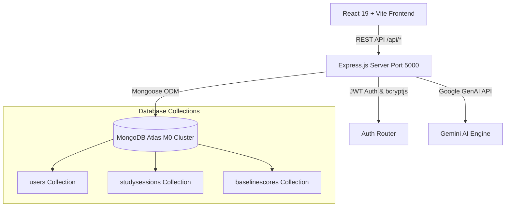

<div align="center">
  <br />
  <h1>🎓 CogniLearn AI</h1>
  <p><b>Intelligent Cognitive Learning, Focus Tracking & Educator Analytics Platform</b></p>
  
  [](https://react.dev/)
  [](https://www.typescriptlang.org/)
  [](https://vitejs.dev/)
  [](https://expressjs.com/)
  [](https://www.mongodb.com/cloud/atlas)
  [](https://tailwindcss.com/)
  <br /><br />
</div>

---

## 🌟 Overview

**CogniLearn AI** is a full-stack, AI-powered educational application designed to optimize student focus, track cognitive performance, and empower educators with real-time classroom engagement analytics.

Built with **React 19**, **TypeScript**, **Express.js**, and **MongoDB Atlas**, CogniLearn seamlessly pairs modern glassmorphic visual design with backend data persistence, webcam AI facial reticles, and gamified XP rewards.

---

## ✨ Key Features

### 🎓 Student Experience
- **Interactive 3-Step Onboarding Wizard**:
  - Step 1: Account credentials with a live **Password Strength Meter** (Weak / Fair / Good / Strong).
  - Step 2: **AI Profile Photo Capture** featuring an interactive WebCam feed with glowing face-tracking reticle overlays & preset avatar options.
  - Step 3: **Academic Profiling** (Grade levels 9-12/College, target exam tracks like CBSE/JEE/NEET, and learning styles: Visual, Auditory, Kinesthetic).
- **Focus Timer & XP Engine**: Interactive Pomodoro/Deep Work focus sessions with automated XP accumulation and level progression.
- **Cognitive Baseline Assessment**: Diagnostics measuring focus indices, retention rates, and subject proficiency.

### 🏫 Educator Experience
- **Split-Screen Glassmorphic Portal**: High-impact portal showcasing live classroom engagement statistics (`94.8% Avg Engagement`, attention risk alerts, and student monitoring cards).
- **Role Selection & Verification**: Tailored views for *Class Teachers*, *Subject Teachers*, and *Coordinators* with automatic institutional email verification (`.edu`, `.edu.in`, `.ac.in`).
- **Real-Time Monitoring**: Heatmaps and intervention flags to support students needing extra assistance.

### 💾 Backend & Account Management
- **MongoDB Atlas Integration**: Native Mongoose data models for Users, Baseline Scores, and Study Sessions.
- **Base64 Photo Storage**: Direct storage of profile avatars within MongoDB Atlas documents (ideal for free-tier setups).
- **Self-Service Account Deletion (Individual Mode)**: Users can edit preferences or permanently delete their account and associated data from MongoDB Atlas via an interactive verification dialog (`"DELETE MY ACCOUNT"`).

---

## 🏗️ System Architecture



---

## 📁 Repository Structure

```text
COGNILEARN/
├── server/                      # Express.js Backend
│   ├── index.ts                 # Main Server Entrypoint & CORS/Payload Config
│   ├── db.ts                    # Mongoose MongoDB Atlas Connection (with DNS SRV Fix)
│   ├── models/
│   │   ├── User.ts              # Student & Teacher Mongoose Schema
│   │   ├── BaselineScore.ts     # Cognitive Assessment Scores Schema
│   │   └── StudySession.ts      # Focus Timer Sessions Schema
│   └── routes/
│       ├── auth.ts              # Register, Login, & Session Restore Routes
│       ├── student.ts           # Student Profile & Focus Session Sync Routes
│       ├── baseline.ts          # Baseline Score Tracking Routes
│       └── user.ts              # Profile Updates & Permanent Account Deletion
│
├── src/                         # React 19 Frontend
│   ├── components/
│   │   ├── Navbar.tsx           # Global Header Navigation & Settings Launcher
│   │   ├── LandingPage.tsx      # Platform Hero Page
│   │   ├── StudentAuth.tsx      # 3-Step Student Onboarding Wizard
│   │   ├── TeacherAuth.tsx      # Split-Screen Educator Portal
│   │   ├── StudentDashboard.tsx # Student Focus & XP Dashboard
│   │   ├── TeacherDashboard.tsx # Educator Classroom Analytics Dashboard
│   │   └── AccountSettingsModal.tsx # Profile Editor & Danger Zone Account Deletion
│   ├── services/
│   │   └── api.ts               # Centralized REST API Service Client
│   ├── types.ts                 # TypeScript Interfaces (User, Route, Metrics)
│   ├── App.tsx                  # Primary App Component & Session Restorer
│   ├── main.tsx                 # React DOM Entrypoint
│   └── index.css                # Global Tailwind CSS Styles
│
├── .env.example                 # Environment Variable Template
├── package.json                 # Project Dependencies & Scripts
└── vite.config.ts               # Vite Proxy & Server Configuration
```

---

## 🚀 Getting Started

### Prerequisites
- **Node.js**: v18.0.0 or higher
- **npm**: v9.0.0 or higher
- **MongoDB Atlas Account**: [Free M0 Cluster](https://www.mongodb.com/cloud/atlas)

### 1. Clone & Install Dependencies
```bash
git clone https://github.com/YOUR_USERNAME/COGNILEARN.git
cd COGNILEARN
npm install
```

### 2. Configure Environment Variables
Create a `.env` file in the root directory:

```env
# Gemini AI Key (Optional)
GEMINI_API_KEY="your_gemini_api_key"

# Host URL
APP_URL="http://localhost:3000"

# MongoDB Atlas Connection URI
MONGODB_URI="mongodb+srv://<username>:<password>@cluster0.xxxx.mongodb.net/cognilearn?retryWrites=true&w=majority"

# JWT Secret Key for Session Signing
JWT_SECRET="cognilearn_super_secret_jwt_key_2026"

# Express Backend Port
PORT=5000
```

> 💡 *Note: If your MongoDB password contains special characters like `@`, URL-encode them (e.g., replace `@` with `%40`).*

### 3. Run the Application
Launch both the **Vite React Frontend** and **Express Backend** concurrently:

```bash
npm run dev
```

- **Frontend Application**: [http://localhost:3000](http://localhost:3000)
- **Backend API Server**: [http://localhost:5000](http://localhost:5000)

---

## 📤 Pushing to GitHub

To push your local repository to GitHub:

```bash
# 1. Initialize git (if not already initialized)
git init

# 2. Stage all files
git add .

# 3. Commit your changes
git commit -m "feat: complete full-stack MongoDB Atlas integration, student wizard, teacher portal, and account deletion"

# 4. Link your remote repository
git remote add origin https://github.com/YOUR_USERNAME/COGNILEARN.git

# 5. Push to main branch
git branch -M main
git push -u origin main
```

---

## 📜 License

Distributed under the MIT License. See `LICENSE` for more details.
