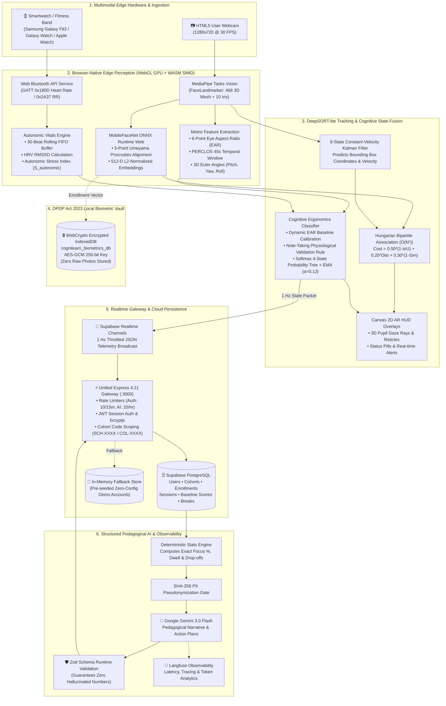

<div align="center">
  <br />
  
  <h1>🎓 CogniLearn AI</h1>
  <p><b>Privacy-First, Edge-AI Cognitive Learning, Attention Analytics & Classroom Intelligence Platform</b></p>
  
  <p>
    <a href="https://cognilearnpdl.vercel.app/" target="_blank">
      
    </a>
  </p>

  [](https://cognilearnpdl.vercel.app/)
  [](https://react.dev/)
  [](https://www.typescriptlang.org/)
  [](https://vitejs.dev/)
  [](https://expressjs.com/)
  [](https://supabase.com/)
  [](https://deepmind.google/technologies/gemini/)
  [](https://github.com/Kart-1307/CogniLearn)
  [-brightgreen)](https://github.com/Kart-1307/CogniLearn)
  [](https://github.com/Kart-1307/CogniLearn/blob/main/LICENSE)
  <br /><br />
</div>

---

> 🌐 **LIVE CLOUD APPLICATION:** [**https://cognilearnpdl.vercel.app/**](https://cognilearnpdl.vercel.app/)  
> ⚡ **INSTANT EVALUATOR ACCESS:** Pre-configured demo accounts are ready out of the box with zero setup needed:  
> • **Teacher Portal:** `teacher@cognilearn.com` / `TeacherPass123!` (or College: `college-teacher@cognilearn.com`)  
> • **Student Portal:** `student@cognilearn.com` / `StudentPass123!` (or College: `college-student@cognilearn.com`)  
> *(You can also test the 3-step biometric onboarding wizard to enroll your own live face reticle & track attention!)*

---

## 🌟 Overview

**CogniLearn AI** is an enterprise-grade cognitive learning and educator analytics platform engineered for modern classrooms and independent study. It combines **Edge-First Computer Vision**, **mathematical gaze modeling**, **multimodal smartwatch vitals**, and **structured generative AI** to optimize student engagement while strictly safeguarding biometric privacy.

Unlike traditional monitoring tools that stream intrusive video feeds to the cloud, CogniLearn processes 100% of video telemetry **locally in the browser** via WebAssembly and WebGL. Only anonymized, aggregated numeric telemetry (focus scores, PERCLOS fatigue, head pose vectors) ever touches the network.

### 📋 Hackathon Submission & Technical Checklist

| Requirement | Artifact / Verification Location | Status |
| :--- | :--- | :--- |
| **Setup Steps & Env Config** | [Quickstart Guide](#-getting-started) & [`.env.example`](.env.example) | ✅ Complete & Documented |
| **Technical Design Document** | [`ARCHITECTURE.md`](ARCHITECTURE.md) & [`CogniLearn_System_Architecture_and_Features.pdf`](CogniLearn_System_Architecture_and_Features.pdf) | ✅ Complete (Architecture, ERDs, Formulas) |
| **Sample Data & Test Cases** | [`sample_data/`](sample_data/) & [`scripts/test_pipeline.ts`](scripts/test_pipeline.ts) (`npm test`) | ✅ 100% Passing (All 7 Test Suites) |
| **Open Source License** | [`LICENSE`](LICENSE) (Standard MIT License) | ✅ Complete & Verified |
| **Live Deployed App** | [https://cognilearnpdl.vercel.app/](https://cognilearnpdl.vercel.app/) | ✅ Live Deployed |

> 📖 **Deep Dive Documentation**: For mathematical specifications, Kalman/Hungarian tracking details, and ER diagrams, see [`ARCHITECTURE.md`](ARCHITECTURE.md) or download the formal PDF specification [`CogniLearn_System_Architecture_and_Features.pdf`](CogniLearn_System_Architecture_and_Features.pdf).

---

## ✨ Key Features

### 🎓 1. Student Experience
- **Interactive 3-Step Onboarding Wizard**:
  - **Account Security**: Real-time password strength meter and cryptographic credentials.
  - **AI Facial Calibration**: In-browser facial calibration reticle powered by MediaPipe Face Mesh; creates a 512-dimensional normalized embedding vector stored locally.
  - **Academic Profiling**: Dual-tier onboarding customized for **School** (Class 6–12, CBSE/ICSE, Board tracks) or **Higher Education** (B.Tech, B.Sc, B.Com, Semesters, Departments).
- **Multimodal Wearable Vitals (Web Bluetooth GATT)**: Direct browser-to-hardware BLE connection to **Samsung Galaxy Fit3**, **Galaxy Watch**, **Apple Watch**, and BLE heart rate monitors (GATT Service `0x180D`, Characteristic `0x2A37`). Computes live **Heart Rate (BPM)** and **HRV RMSSD (ms)** in a rolling 30-beat FIFO buffer to physiologically cross-validate deep focus vs stress vs fatigue.
- **Adaptive Dual-Theme SaaS Interface**: Instant toggle between deep slate glassmorphism (dark mode for low-light focus) and high-contrast daylight SaaS (light mode with WCAG 2.1 AA readability), with zero-flicker `localStorage` persistence.
- **Gamified Focus Timer (Deep Work)**: Customizable Pomodoro blocks (5m to 60m) with ambient audio, streak tracking, and XP reward engines.
- **AI-Powered Diagnostics & Action Plans**: Post-session diagnostic reports providing cognitive indices, fatigue assessments, and actionable revision schedules synthesized by Google Gemini 3.0 Flash.

### 🏫 2. Educator & Classroom Portal
- **Real-Time Classroom Telemetry**: Split-screen live monitoring tracking cohort engagement, distraction risk indicators, and active student counts.
- **Multi-Face Edge Tracking**: In-camera multi-student detection utilizing:
  - **5-Point Umeyama Facial Alignment**
  - **Kalman Filter Position & Velocity Estimation**
  - **Hungarian (Kuhn-Munkres) Bipartite Spatial Association**
  - Continuous recognition against enrolled cohort student embeddings.
- **Cohort Management**: Generate unique class codes (`SCH-XXXX` or `COL-XXXX`), manage student rosters, and assign subject curricula.
- **Attendance & Engagement Logs**: Automatic attendance verification correlated with live attention metrics.

### 🔒 3. Privacy & Compliance
- **Zero-Cloud-Video Guarantee**: Camera frames are processed exclusively in the browser and discarded immediately. No video frames are ever recorded, streamed, or uploaded to servers.
- **DPDP Act 2023 (India) & COPPA/FERPA Compliant**: Biometric data is converted into one-way mathematical embeddings; all AI generation uses SHA-256 pseudonymized identifiers.
- **Zero Hallucinated Numbers**: Quantitative metrics (average focus, peak attention, minutes) are computed deterministically in TypeScript; Gemini is strictly constrained by Zod schemas for qualitative pedagogical insights.

---

## 🏗️ System Architecture & Multimodal Engineering

CogniLearn AI is engineered around an **Edge-First, Multimodal Perception & Physiological Telemetry Architecture**. Computer vision, facial mesh extraction, and biometric inferences run 100% locally in the browser over WebGL and WebAssembly SIMD. Video frames never leave the client device; only lightweight, anonymized 1 Hz state packets are transmitted to cloud endpoints.


```mermaid
flowchart TD
    %% SUBGRAPH 1: INPUT SENSORS
    subgraph SENSORS["1. Multimodal Edge Hardware & Ingestion"]
        Webcam["📷 HTML5 User Webcam<br/>(1280x720 @ 30 FPS)"]
        BLE["⌚ Smartwatch / Fitness Band<br/>(Samsung Galaxy Fit3 / Galaxy Watch / Apple Watch)"]
    end

    %% SUBGRAPH 2: EDGE PERCEPTION
    subgraph EDGE["2. Browser-Native Edge Perception (WebGL GPU + WASM SIMD)"]
        MediaPipe["MediaPipe Tasks Vision<br/>(FaceLandmarker: 468 3D Mesh + 10 Iris)"]
        WebBluetooth["Web Bluetooth API Service<br/>(GATT 0x180D Heart Rate / 0x2A37 RR)"]
        
        EAR_Euler["Metric Feature Extraction<br/>• 6-Point Eye Aspect Ratio (EAR)<br/>• PERCLOS 45s Temporal Window<br/>• 3D Euler Angles (Pitch, Yaw, Roll)"]
        Umeyama_ONNX["MobileFaceNet ONNX Runtime Web<br/>• 5-Point Umeyama Procrustes Alignment<br/>• 512-D L2-Normalized Embeddings"]
        HRV_RMSSD["Autonomic Vitals Engine<br/>• 30-Beat Rolling FIFO Buffer<br/>• HRV RMSSD Calculation<br/>• Autonomic Stress Index (S_autonomic)"]
    end

    %% SUBGRAPH 3: MULTI-TARGET TRACKING & ERGONOMICS
    subgraph TRACKING["3. DeepSORT-lite Tracking & Cognitive State Fusion"]
        Kalman["8-State Constant-Velocity Kalman Filter<br/>Predicts Bounding Box Coordinates & Velocity"]
        Hungarian["Hungarian Bipartite Association (O(N³))<br/>Cost = 0.50*(1-IoU) + 0.20*Dist + 0.30*(1-Sim)"]
        CognitiveModel["Cognitive Ergonomics Classifier<br/>• Dynamic EAR Baseline Calibration<br/>• Note-Taking Physiological Validation Rule<br/>• Softmax 4-State Probability Tree + EMA (α=0.12)"]
        AR_HUD["Canvas 2D AR HUD Overlays<br/>• 3D Pupil Gaze Rays & Reticles<br/>• Status Pills & Real-time Alerts"]
    end

    %% SUBGRAPH 4: PERSISTENCE & LOCAL CRYPTO
    subgraph CRYPTO["4. DPDP Act 2023 Local Biometric Vault"]
        IndexedDB[("🔒 WebCrypto Encrypted IndexedDB<br/>cognilearn_biometrics_db<br/>AES-GCM 256-bit Key<br/>(Zero Raw Photos Stored)")]
    end

    %% SUBGRAPH 5: REALTIME & BACKEND
    subgraph BACKEND["5. Realtime Gateway & Cloud Persistence"]
        Realtime["📡 Supabase Realtime Channels<br/>1 Hz Throttled JSON Telemetry Broadcast"]
        Express["⚡ Unified Express 4.21 Gateway (:3000)<br/>• Rate Limiters (Auth: 10/15m, AI: 20/hr)<br/>• JWT Session Auth & bcryptjs<br/>• Cohort Code Scoping (SCH-XXXX / COL-XXXX)"]
        Postgres[("🗄️ Supabase PostgreSQL<br/>Users • Cohorts • Enrollments<br/>Sessions • Baseline Scores • Breaks")]
        MemoryStore[("💾 In-Memory Fallback Store<br/>(Pre-seeded Zero-Config Demo Accounts)")]
    end

    %% SUBGRAPH 6: GENERATIVE PEDAGOGICAL AI
    subgraph GENAI["6. Structured Pedagogical AI & Observability"]
        StatsEngine["Deterministic Stats Engine<br/>Computes Exact Focus %, Dwell & Drop-offs"]
        PII_Gate["SHA-256 PII Pseudonymization Gate"]
        Gemini["🤖 Google Gemini 3.0 Flash<br/>Pedagogical Narrative & Action Plans"]
        Zod["🛡️ Zod Schema Runtime Validation<br/>(Guarantees Zero Hallucinated Numbers)"]
        Langfuse["🔭 Langfuse Observability<br/>Latency, Tracing & Token Analytics"]
    end

    %% CONNECTIONS
    Webcam --> MediaPipe
    BLE --> WebBluetooth
    
    MediaPipe --> EAR_Euler
    MediaPipe --> Umeyama_ONNX
    WebBluetooth --> HRV_RMSSD
    
    Umeyama_ONNX -.->|Enrollment Vector| IndexedDB
    
    EAR_Euler --> CognitiveModel
    HRV_RMSSD --> CognitiveModel
    Umeyama_ONNX --> Hungarian
    
    MediaPipe --> Kalman
    Kalman --> Hungarian
    Hungarian --> AR_HUD
    CognitiveModel --> AR_HUD
    
    CognitiveModel -->|1 Hz State Packet| Realtime
    Realtime --> Express
    Express --> Postgres
    Express -.->|Fallback| MemoryStore
    
    Postgres --> StatsEngine
    StatsEngine --> PII_Gate
    PII_Gate --> Gemini
    Gemini --> Zod
    Gemini -.-> Langfuse
    Zod --> Express
```

### 🔄 Multi-Tier Layer Architecture Breakdown

| Architecture Tier | Components & Protocols | Technical Implementation & Privacy Guarantees |
| :--- | :--- | :--- |
| **Edge Perception Layer** | MediaPipe Tasks Vision (`0.10.18`), WebGL Shaders | Extracts 468 3D facial landmarks and 10 iris coordinates at 30 FPS entirely within the client's GPU memory. Zero frames are transmitted to any server. |
| **Physiological Vitals Layer** | Web Bluetooth GATT (`0x180D`, `0x2A37`), PPG Sensors | Streams real-time heart rate (BPM) and RR-intervals directly from Samsung Galaxy Fit3/Watch and Apple Watch into a 30-beat FIFO buffer; computes HRV RMSSD. |
| **Tracking & Association Layer** | 8-State Kalman Filter, Kuhn-Munkres Hungarian ($O(N^3)$) | Tracks up to 6 classroom students simultaneously with spatial gating ($>1.5\times$ box width forbidden) and 15-frame identity locking hysteresis to prevent ID swapping. |
| **Cognitive Inference Engine** | Softmax Decision Tree, Dynamic EAR Baselines | Evaluates 4 distinct states (`SCREEN_FOCUS`, `NOTE_TAKING`, `COGNITIVE_REFLECTION`, `OFF_TASK`). Uses autonomic vitals ($\text{RMSSD} \ge 35\text{ms}$) to confirm desk writing. |
| **Biometric Privacy Vault** | WebCrypto API (`window.crypto.subtle`), IndexedDB | Encrypts 512-D MobileFaceNet vectors locally using hardware-bound AES-GCM 256-bit keys under DPDP Act 2023 compliance. Raw imagery is immediately discarded. |
| **Realtime Telemetry Layer** | Supabase Realtime WebSockets (1 Hz throttled) | Broadcasts compact 90-byte JSON telemetry state packets (`{studentId, state, score, heartRate, hrv}`) to the teacher's live dashboard HUD. |
| **Pedagogical AI Layer** | Google Gemini 3.0 Flash, Zod Runtime Validation | Translates deterministic TypeScript metrics into formative narrative reports. Quantitative metrics are strictly guarded against LLM hallucination via Zod. |

---

## 📁 Repository Structure

```text
COGNILEARN/
├── ARCHITECTURE.md              # Complete System Architecture & Mathematical Specification
├── CogniLearn_System_Architecture_and_Features.pdf # Formal PDF Architecture Specification (v2.5.0)
├── LICENSE                      # Open-Source MIT License
├── supabase-schema.sql          # Supabase PostgreSQL DDL (Tables, Constraints, Indexes)
├── sample_data/                 # Standalone Sample Datasets & Evaluator Fixtures
│   ├── README.md                # Guide to Sample Telemetry & Rosters
│   ├── telemetry_sample.json    # 1 Hz Telemetry Frames (States, EAR, Euler, HR/HRV)
│   ├── cohort_roster_sample.json# School & College Academic Cohort Rosters
│   └── diagnostic_report_sample.json # Sample Gemini 3.0 Flash AI Diagnostic Output
├── server/                      # Express.js Backend Application
│   ├── index.ts                 # Main Server Entrypoint & Unified Static Serving (:3000)
│   ├── supabase.ts              # Supabase Client & Relational Mapping Layer
│   ├── memoryStore.ts           # Zero-Config Fallback In-Memory Database with Demo Data
│   ├── authMiddleware.ts        # JWT Authentication & Role-Based Access Control (RBAC)
│   └── routes/
│       ├── auth.ts              # Student/Teacher Authentication & Face Descriptors
│       ├── cohorts.ts           # Class Cohort Management & IDOR-Protected Rosters
│       ├── student.ts           # Student Profiles, Focus Sessions & Break Logs
│       ├── user.ts              # Profile Updates, Account Deletion & Protected Reset
│       ├── baseline.ts          # Cognitive Baseline Assessments
│       └── report.ts            # Deterministic Stats Engine & Gemini AI Reporting
│
├── src/                         # React 19 Frontend Application
│   ├── components/
│   │   ├── Navbar.tsx           # Responsive Navigation Bar with Theme & Wearable Toggles
│   │   ├── LandingPage.tsx      # Platform Hero Page & Architectural Features
│   │   ├── StudentAuth.tsx      # 3-Step Student Onboarding Wizard
│   │   ├── TeacherAuth.tsx      # Split-Screen Educator Authentication Portal
│   │   ├── StudentDashboard.tsx # Attention Analytics, BLE Vitals HUD & Pomodoro Timer
│   │   ├── TeacherDashboard.tsx # Educator Live Classroom Monitoring & DeepSORT Tracker
│   │   ├── AcademicProfileForm.tsx # Dynamic School/College Profile Form
│   │   ├── ResetDatabaseModal.tsx  # Double-Confirmation Database Purge Dialog
│   │   └── AccountSettingsModal.tsx # Profile Management & Account Deletion
│   ├── services/
│   │   ├── api.ts               # Centralized REST API Client
│   │   ├── faceTracker.ts       # MediaPipe Edge Vision & Facial Reticle Engine
│   │   ├── faceMatcher.ts       # 512-D Cosine Metric Multi-Face Recognizer
│   │   ├── trackingHarness.ts   # Kalman + Hungarian Multi-Track Association
│   │   ├── bleHeartRateService.ts # Web Bluetooth GATT (0x180D/0x2A37) HR & HRV RMSSD
│   │   └── telemetryStream.ts   # Realtime WebSocket Streamer
│   ├── schemas/
│   │   └── academic.ts          # Zod Validation Schemas for Curricula & Auth
│   ├── types.ts                 # Core TypeScript Definitions
│   ├── App.tsx                  # Root Routing & State Management
│   └── main.tsx                 # React DOM Root
│
├── scripts/
│   └── test_pipeline.ts         # Automated 7-Phase Mathematical Verification Suite
├── .env.example                 # Environment Variable Reference
└── package.json                 # Project Dependencies & Build Scripts
```

---

## 🚀 Getting Started

### Prerequisites
- **Node.js**: v18.0.0 or higher (v20+ recommended)
- **npm**: v9.0.0 or higher
- **Supabase Account**: (Optional — application automatically runs in zero-config memory mode if unconfigured)

### 1. Installation
Clone the repository and install all dependencies:

```bash
git clone https://github.com/Kart-1307/CogniLearn.git
cd CogniLearn
npm install
```

### 2. Environment Configuration
Create a `.env` file in the root directory by copying `.env.example`:

```bash
cp .env.example .env
```

Configure your environment variables:

```env
# Authentication JWT Secret
JWT_SECRET=your_jwt_secret_here

# Supabase PostgreSQL Configuration (Optional: memory store activates if omitted)
SUPABASE_URL=https://your-project-id.supabase.co
VITE_SUPABASE_URL=https://your-project-id.supabase.co
SUPABASE_SERVICE_ROLE_KEY=your-supabase-service-role-key
SUPABASE_ANON_KEY=your-supabase-anon-key
VITE_SUPABASE_ANON_KEY=your-supabase-anon-key

# Google Gemini AI Configuration
GEMINI_API_KEY=AIzaSy...your_gemini_api_key_here
GEMINI_MODEL=gemini-3.0-flash

# Langfuse Observability (Optional)
LANGFUSE_PUBLIC_KEY=pk-lf-...
LANGFUSE_SECRET_KEY=sk-lf-...
LANGFUSE_BASEURL=https://cloud.langfuse.com
```

### 3. Database Initialization (Supabase PostgreSQL)
If using Supabase:
1. Open your Supabase Project Dashboard.
2. Navigate to the **SQL Editor**.
3. Copy the entire contents of [`supabase-schema.sql`](supabase-schema.sql) and execute it.
4. All 9 tables, indexes, check constraints, and foreign key cascades will be created automatically.

---

## 💻 Running the Application

### Development Server
Starts the unified Express backend and Vite development server on **Port 3000**:

```bash
npm run dev
```

Navigate to [http://localhost:3000](http://localhost:3000) in your browser.

### Run Automated Test Suite
Executes the comprehensive 6-phase mathematical test suite (Kalman filter, Hungarian algorithm, Umeyama alignment, 512-D L2 normalization, attention classification, tracking diagnostics):

```bash
npm test
```

### TypeScript Type-Checking
```bash
npm run lint
```

### Production Build
Generates the optimized client bundle and compiled Node.js server:

```bash
npm run build
npm start
```

---

## 👥 Demo Credentials

For quick evaluation during hackathons and demonstrations, CogniLearn provides instant demo accounts:

| Role | Academic Tier | Email | Password |
| :--- | :--- | :--- | :--- |
| **Teacher (School)** | K-12 Secondary | `teacher@cognilearn.com` | `TeacherPass123!` |
| **Teacher (College)** | Higher Education | `college-teacher@cognilearn.com` | `TeacherPass123!` |
| **Student (School)** | Class 10 CBSE | `student@cognilearn.com` | `StudentPass123!` |
| **Student (College)** | B.Tech CSE | `college-student@cognilearn.com` | `StudentPass123!` |

*(You can also register brand-new teacher and student accounts through the interactive onboarding wizards!)*

---

## 📜 License

Distributed under the **MIT License**. See `LICENSE` for details.
